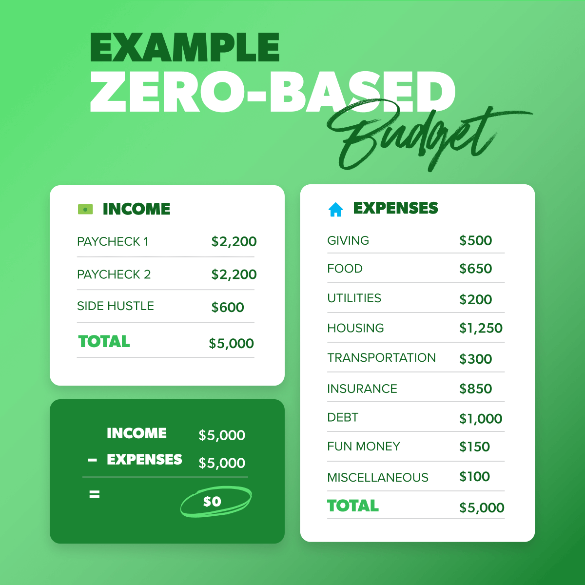

# Daily Life Schedule 2023

[Slide Deck](https://www.canva.com/design/DAF3Ax80H_E/h89RsXyCPmApFJliU8Y2JQ/view?utm_content=DAF3Ax80H_E&utm_campaign=designshare&utm_medium=link&utm_source=editor)

## Budgeting

[Reference](https://www.ramseysolutions.com/budgeting/how-to-make-a-zero-based-budget)

### Resources
- Budgeting
  - [7 Baby Steps](https://www.ramseysolutions.com/dave-ramsey-7-baby-steps)
  - [Budgeting Myths](https://www.ramseysolutions.com/budgeting/budgeting-myths)
    - Apps
      - [YNAB](https://www.ynab.com/)
      - [Every Dollar](https://www.ramseysolutions.com/ramseyplus/everydollar)
      - [Empower - Tracking](https://www.empower.com/)
    - Bank Accounts with Sub Accounts:
      - [Ally Bank](https://www.ally.com/bank/online-savings-account/)
      - [Capital One - 360 Performance Savings](https://www.capitalone.com/bank/savings-accounts/online-performance-savings-account/)

https://bit.ly/46ToYq9